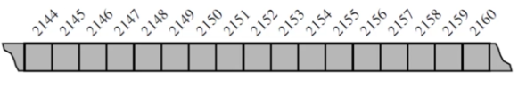
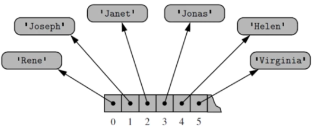
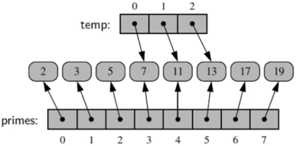
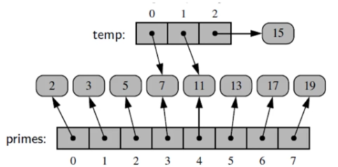
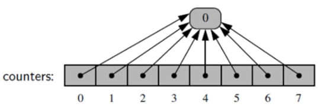
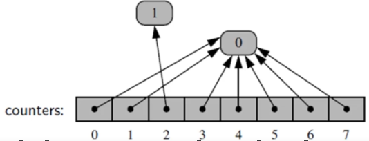
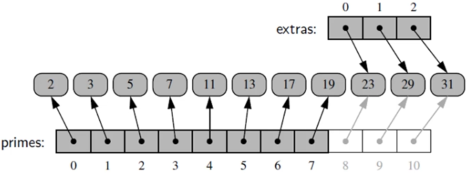

<!-- markdownlint-disable -->

# Low Level Arrays

<h5>This serves as a review on some CS concepts, especially how computers store information at a low level; stored and retrieved</h5>
 

## Architecture

<ul>
    <li>Memory of computer stored in bits</li>
    <li>Typical unit is byte, which is 8 bits</li>
    <li>Computers typically use a memory address</li>
    <li>Each byte associated with unique address</li>
        <ul>
            <li>Byte #2144 versus Byte #2147</li>
        </ul>
</ul>
 

## Arrays

<ul>
    <li>Representation of computer memory</li>
    <li>Individual bytes with consecutive addresses</li>
    
     
     
    <li>Computer hardware is designed, in theory, so that any byte of the main memory can be efficiently accessed</li>
    <li>Computer's main memory performs as <strong>random access memory (RAM)</strong></li>
    <li>Just as easy to retrieve byte #8675309 as it is to retrieve byte #309</li>
    <li>Individual byte of memory can be stored or retrieved in O(1) time</li>
    <li>Programming language keeps track of the association between an identifier and the memory address</li>
    <ul>
        <li>May want a video game to keep track of the top ten scores for that game</li>
        <li>Prefer to use a single name for the group</li>
        <li>Use index numbers to refer to the high scores in that group</li>
    </ul>
    <li>A group of related variables can be stored one after another in a <strong>contiguous</strong> portion of the computer's memory (AKA: ARRAY)</li>
    <ul>
        <li>A text string, for example, is stored as an <strong>ordered sequence</strong> of individual characters.</li>
        <li>Python internally represents each Unicode character with 16 bits (i.e., 2 bytes)</li>
    </ul>
</ul>
 

## Referential Arrays

Imagine 100 student names with ID numbers. Each cell of the array needs to have the same number of bytes. How can we avoid having to have a series of names? we can use an array of object <strong>References</strong>

Each element is a <strong>reference</strong>

 

<ul>
    <li>A single list instance may include multiple references to the same object as elements of the list</li>
    <li>Single object can be an element of two or more lists</li>
    <li>When computing th slice of a list, the result is a new list instance</li>
    <li>New list has references to the same elements that are in the original list</li>
    <ul>
        <li>example: <strong>temp = primes[3:6]</strong></li>
        
        <li>Here we are not creating new objects but REFERENCING the same objects</li>
        <li>temp[2] = 15</li>
        
        <li>we changed the existing reference and index 2 is pointing to another object instead of changing the existing object</li>
    </ul>
    <li><strong>COPYING ARRAYS:</strong></li>
    <ul>
        <li><strong>backup = list(primes)</strong></li>
        <li>This produces a new list that is a <strong>shallow copy</strong> in that it references the same elements as in the first list</li>
        <li>If the contents of the list were of a mutable type, a <strong>deep copy </strong>, meaning a new list with NEW elements, can be produced by using the deepcopy function from the copy module</li>
        <li>counters = [0] * 8</li>
        <li>All eight cells reference the same object!</li>
        
        <li>counters[2] += 1</li>
        <li>Does not technically change the value of the existing integer instance. This computes a new integer</li>
        
    </ul>
    <li><strong>.extend()</strong></li>
    <ul>
        <li>primes.extend(extras)</li>
        <li>we "append" the primes list by adding the REFERENCES of the extras list</li>
        
    </ul>
</ul>
 
